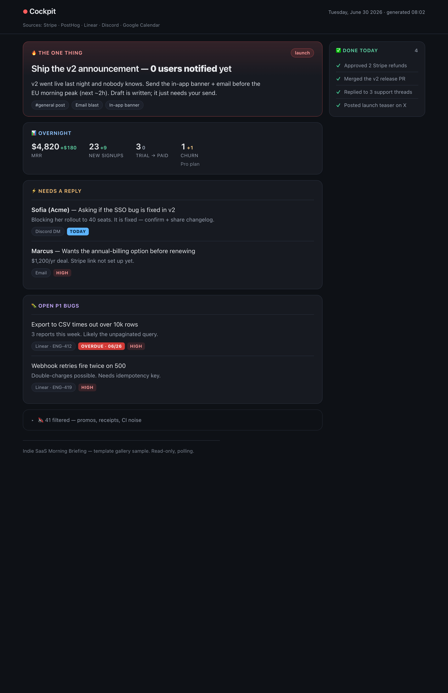
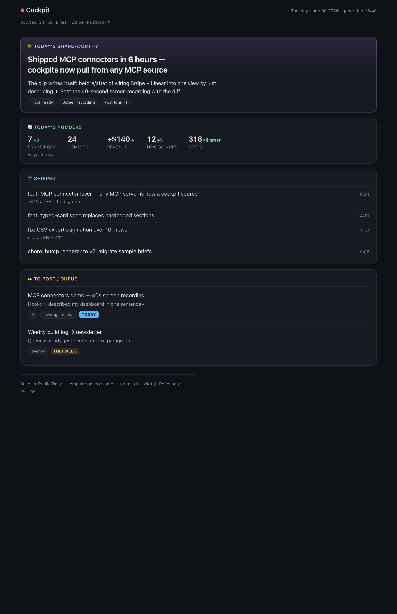

# Cockpit

One ranked view of *what needs you right now* — pulled from all your scattered
sources into a single, self-contained HTML dashboard.

You live across a dozen tools: mail, chat, calendar, tasks, git, billing,
analytics. Gathering the state of your day from all of them is a daily tax. A
**cockpit** does the aggregation for you and renders one ranked *attention
queue* — the answer to "what demands me, in priority order?".

It's **data-driven**: the presentation is a frozen template; each brief is just
a small JSON spec. An agent (Claude or otherwise) authors the spec; a dumb
renderer turns it into the page. That separation is the whole idea — a cockpit
is portable *data*, not bespoke HTML.



## Quick start

No dependencies — just Python 3.

```bash
python3 render.py gallery/morning-briefing.json
open gallery/morning-briefing.html        # macOS  (xdg-open on Linux)
```

That inlines the spec into `template.html` and writes a single `.html` file you
can open anywhere — including `file://` and mobile, because the data is embedded
rather than fetched.

## The spec

A cockpit is an **ordered array of typed cards** plus an optional rail:

```jsonc
{
  "date": "Tuesday, June 30 2026",
  "time": "08:02",
  "sources": "Stripe · PostHog · Linear · Discord · Calendar",
  "footer": "Read-only, polling.",
  "cards": [ /* rendered top → bottom in the main column */ ],
  "rail":  [ "one-liners for the right rail" ],   // omit → main goes full-width
  "railTitle": "✅ Done today"
}
```

Every card has a `type` and an optional `accent`
(`red | amber | blue | violet | green | gray`):

| Type | Shape | For |
|---|---|---|
| `hero` | `title, badge?, headline, sub?, chips?` | the single most important thing |
| `metric` | `title, items:[{label, value, delta?, deltaKind?, sub?}]` | overnight numbers |
| `list` | `title, items:[{who?, what, sub?, chips?, tags?}]` | replies, tasks, bugs |
| `feed` | `title, items:[{what, sub?, meta?}]` | timestamped activity (commits, mentions) |
| `note` | `summary, bodyHtml, collapsed?, footnote?` | folded low-priority noise |

`deltaKind ∈ up | down | warn | flat` (you choose the meaning — `up` is green,
`down` red, `warn` amber). List urgency `tag.kind ∈ late | today | high | med | low`.

The full schema lives in the comment block inside [`template.html`](template.html)
and in [`SKILL.md`](SKILL.md).

## Gallery

Ready-to-render sample cockpits — copy one and swap in your data:

| Sample | Exercises |
|---|---|
| [`gallery/morning-briefing.json`](gallery/morning-briefing.json) | hero · metric · two lists · note · rail |
| [`gallery/build-in-public.json`](gallery/build-in-public.json) | hero · metric · feed · list · **no rail (full-width)** |



## Use it as a Claude skill

[`SKILL.md`](SKILL.md) is a read-only ops-brief skill. Drop this repo into your
agent's skills directory (e.g. `~/.claude/skills/cockpit/`) and invoke
`/cockpit`. The skill aggregates whatever sources you've wired (CLIs, MCP
servers, local files), ranks them — urgency, **convergence** (an item hitting
multiple surfaces at once is the real priority), stakes — and renders the brief.
It never sends, moves, or writes anything.

## How it works

- **Frozen presentation, authored data.** `template.html` holds the CSS + a
  small vanilla-JS renderer and a single `<script type="application/json">`
  data island. `render.py` replaces the island's contents with your spec.
- **Inlined, not fetched.** The spec is embedded in the output so it renders
  offline and on mobile, where fetching a sibling `.json` would be CORS-blocked.
- **Dark, glanceable, accessible.** Six semantic accent colors, WCAG-AA text
  contrast, a reduced-motion-safe entrance, responsive down to a single column.

## License

[MIT](LICENSE).
